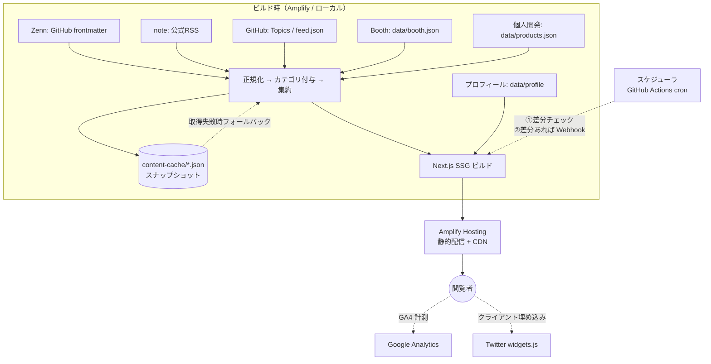
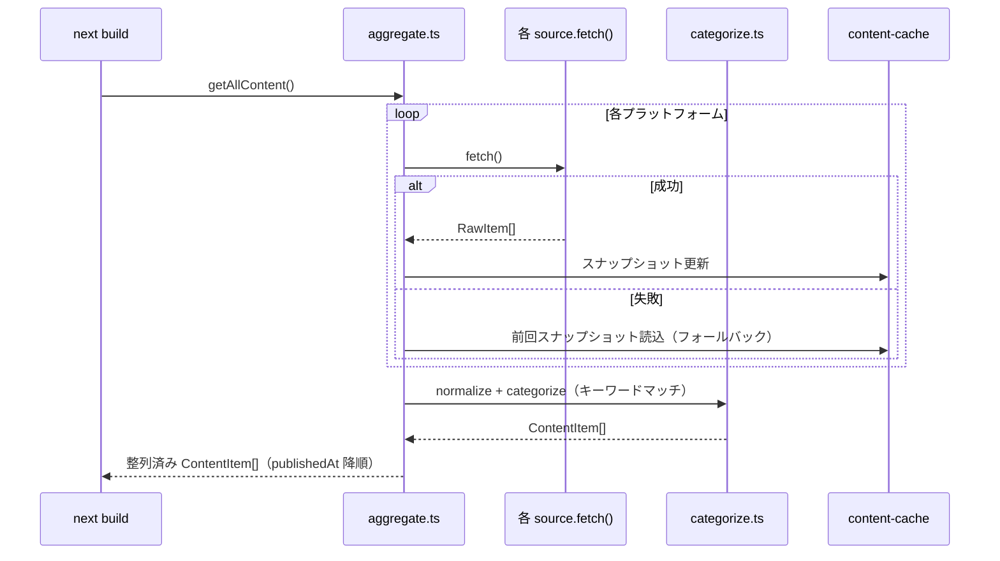

# 設計書 — ねこエンジニア ホームページ

> 要件: [`01_requirements.md`](./01_requirements.md) / 仕様: [`02_specification.md`](./02_specification.md) /
> 取得方針: [`04_content-sources.md`](./04_content-sources.md)

## 1. アーキテクチャ概要

**SSG（ビルド時取得）＋ スケジュール再ビルド** 構成。閲覧時は静的アセットのみを返すため高速・安定・低コスト。



### レンダリング戦略
- **SSG のみ**（ISR/SSR 不使用）。`next build` で静的化。
- フィルタは静的に全件描画し**クライアント側で絞り込み**（追加フェッチ不要）。
- Amplify は **静的ホスティング（WEB）** で運用（compute 不要＝コスト最小）。

## 2. レイヤ構成と責務分離

取得元の差異を**取得アダプタ**に閉じ込め、上位は正規化済みモデルのみ扱う（NFR-06: 追加が容易）。

```
src/
├─ app/                      # Next.js App Router（UI/ページ）
│  ├─ page.tsx               # トップ（唯一のページ）
│  ├─ layout.tsx             # GA4 スクリプト挿入
│  ├─ sitemap.ts / robots.ts
│  └─ components/
│     ├─ Header.tsx
│     ├─ Hero.tsx
│     ├─ FilterBar.tsx       # カテゴリ選択（領域/シリーズ/種別/プラットフォーム）
│     ├─ ContentGrid.tsx     # フィルタ適用 + グリッド描画
│     ├─ ContentCard.tsx
│     ├─ TwitterEmbed.tsx
│     └─ Footer.tsx
├─ content/                  # ← ハブの中核（データ層）
│  ├─ types.ts               # ContentItem 等の正規化モデル
│  ├─ sources/               # 取得アダプタ（1プラットフォーム=1ファイル）
│  │  ├─ zenn.ts             # GitHub frontmatter（フォールバック: 公式RSS）
│  │  ├─ note.ts             # 公式RSS
│  │  ├─ github.ts           # Topics / feed.json（将来: neko-homepage Topic 全探索）
│  │  ├─ booth.ts            # data/booth.json 読み込み
│  │  └─ products.ts         # data/products.json 読み込み
│  ├─ categorize.ts          # カテゴリ自動付与（キーワードマッチ）
│  ├─ category-rules.ts      # キーワード定義（設定ファイル）
│  ├─ aggregate.ts           # 全ソース集約・整列・スナップショット管理・差分検出
│  └─ index.ts               # getAllContent(): ビルド時に呼ぶエントリ
├─ data/                     # 手動更新データ（repo管理）
│  ├─ profile.ts
│  ├─ booth.json
│  ├─ products.json
│  └─ books.json             # GitHub Pages 暫定manifest（MVP期）
└─ content-cache/            # 取得スナップショット（フォールバック用・repo管理）
   ├─ zenn.json
   ├─ note.json
   └─ github.json
```

### 取得アダプタの共通インターフェース
```ts
// content/sources/_types.ts
export interface ContentSource {
  platform: Platform;
  fetch(): Promise<RawItem[]>;  // 失敗時は throw → aggregate でフォールバック
}
```
新規プラットフォーム追加＝ `ContentSource` を1つ実装して `aggregate.ts` に登録するだけ。

## 3. データモデル

全コンテンツを単一の正規化モデルに揃える。UI はこの型のみに依存する。

```ts
// content/types.ts
export type Platform = "zenn" | "note" | "booth" | "github" | "product";

export type Domain = "IT" | "数学" | "ボルダリング" | "プロダクト";
export type ContentType = "資格・勉強" | "単発" | "本";

export interface Category {
  domain: Domain;
  series?: string;        // 例: "ゼロから"
  type: ContentType;
}

export interface ContentItem {
  id: string;             // 安定キー（platform + slug/urlハッシュ）
  platform: Platform;
  title: string;
  url: string;            // 元プラットフォームの公開URL
  publishedAt?: string;   // ISO8601（取得できない場合は未設定）
  excerpt?: string;
  thumbnail?: string;
  tags: string[];         // 元のtopics/タグ（生・キーワードマッチに使用）
  category: Category;
  source: "auto" | "manual";
}
```

## 4. 取得 → 整形 → 集約パイプライン



- **重複排除**: `id` で一意化。
- **整列**: `publishedAt` 降順、日付不明は末尾。
- **フォールバック**: ソース単位で独立。1つ落ちても全体は成立（NFR-05 / FR-09）。

## 5. カテゴリ自動付与（FR-08）

手動マッピング表は設けず、**プラットフォームが持つメタデータ + キーワードマッチ**で完結させる。

```ts
// content/category-rules.ts（設定ファイル — ロジックは薄く、追加は1行）
export const domainKeywords: { pattern: RegExp; domain: Domain }[] = [
  // タグ（topics）とタイトルの両方にマッチを試みる（順番が優先度）
  { pattern: /typescript|javascript|python|aws|gcp|react|nextjs|docker|linux|プログラミング|エンジニア|開発|api/i, domain: "IT" },
  { pattern: /数学|math|線形代数|微積分|確率|統計/i, domain: "数学" },
  { pattern: /ボルダリング|クライミング|boulder|climb/i, domain: "ボルダリング" },
  { pattern: /プロダクト|サービス|リリース|startup/i, domain: "プロダクト" },
];

export const domainDefaultByPlatform: Record<Platform, Domain> = {
  zenn: "IT",
  note: "IT",        // マッチしない場合の既定（noteはキーワードマッチを優先）
  booth: "IT",
  github: "数学",
  product: "プロダクト",
};

export const seriesPatterns: { match: RegExp; series: string }[] = [
  { match: /ゼロから/, series: "ゼロから" },
];

export const typeRules = {
  bookPlatforms: ["github", "booth"] as Platform[],
  bookTagPattern: /^本$/,
  studyPattern: /資格|試験|勉強|検定/,
};
```

判定順:
1. `type: "tech"` など**プラットフォーム公式の分類**（Zenn のみ）→ 領域確定
2. **タグ（topics）にキーワードマッチ** → 領域確定
3. **タイトルにキーワードマッチ** → 領域確定（フォールバック）
4. **プラットフォーム既定値** → 領域確定（最終フォールバック）
5. シリーズ: タイトルのパターンマッチ
6. 種別: プラットフォーム・タグ・タイトルからルール判定

## 6. デプロイと再ビルド（FR-05 / FR-11 / FR-12）

### ホスティング
- **AWS Amplify Hosting（静的）**。`main` への push で自動ビルド・デプロイ（Amplify 標準）。

### ローカルビルド（FR-12）
```bash
# 事前に環境変数を設定（.env.local）
npm run build   # Next.js SSG ビルド（本番と同一）
npm run start   # ビルド成果物の確認用
```
外部取得の失敗はスナップショットにフォールバックするため、ローカルでも基本的にビルド成功する。

### スケジュール再ビルド＋差分チェック（FR-11 / NFR-01）

GitHub Actions で **「差分がなければ Amplify ビルドをスキップ」** するフローを実装する。
差分チェックは「現在のコンテンツスナップショット vs 取得結果のハッシュ比較」で行う（実装シンプル）。

```yaml
# .github/workflows/scheduled-rebuild.yml
on:
  schedule: [{ cron: "0 12 * * *" }]   # 12:00 UTC = 21:00 JST
  workflow_dispatch:                    # 手動実行（FR-12）
jobs:
  check-and-rebuild:
    runs-on: ubuntu-latest
    steps:
      - uses: actions/checkout@v4
      - uses: actions/setup-node@v4
        with: { node-version: 20 }
      - run: npm ci

      # 最新コンテンツを取得し、スナップショットとの差分を確認
      - name: Check content diff
        id: diff
        run: node scripts/check-content-diff.js
        env:
          GITHUB_TOKEN: ${{ secrets.GITHUB_TOKEN }}  # 公式・自動発行・設定不要

      # 差分があった場合のみ Amplify 再ビルドを起動
      - name: Trigger Amplify rebuild
        if: steps.diff.outputs.has_diff == 'true'
        run: curl -X POST -d {} "${{ secrets.AMPLIFY_BUILD_WEBHOOK }}" -H "Content-Type:application/json"
```

差分チェックスクリプト（`scripts/check-content-diff.js`）は:
1. 各ソースから現在のコンテンツを取得
2. `content-cache/*.json`（前回スナップショット）とハッシュ比較
3. 差分あり → `has_diff=true` を出力 → Amplify 再ビルド
4. 差分なし → `has_diff=false` → 再ビルドスキップ

> **実装上の注意**: 差分チェックロジックが複雑化しそうな場合は、FR-11 は「推奨」なのでスキップして
> 無条件再ビルドに戻す。コア機能（FR-05, FR-12）を優先する。

### 環境変数（ビルド時）

| 変数 | 必須 | 用途 |
|---|---|---|
| `ZENN_GH_REPO` | ✅ | Zenn記事のGitHubリポジトリ（例: `nekoneko02/zenn`） |
| `NOTE_RSS_URL` | ✅ | note の RSS URL |
| `GITHUB_TOKEN` | 推奨 | GitHub API レート緩和（Actions 自動発行・パブリックなら省略可） |
| `TWITTER_HANDLE` | ✅ | Twitter 埋め込みのアカウント名 |
| `NEXT_PUBLIC_GA_MEASUREMENT_ID` | ✅ | Google Analytics 計測ID（`G-XXXXXXXXXX`）|
| `AMPLIFY_BUILD_WEBHOOK` | スケジュール用 | Amplify のビルドトリガー Webhook URL（Secrets に格納） |

## 7. Google Analytics 組み込み（FR-10 / NFR-09）

**GA4**（Google Analytics 4）を使用。

```tsx
// app/layout.tsx
import Script from 'next/script';

const GA_ID = process.env.NEXT_PUBLIC_GA_MEASUREMENT_ID;

// GA_ID が設定されている場合のみ Script を挿入（ローカル等で計測不要な場合は未設定でよい）
{GA_ID && (
  <>
    <Script src={`https://www.googletagmanager.com/gtag/js?id=${GA_ID}`} strategy="afterInteractive" />
    <Script id="ga-init" strategy="afterInteractive">{`
      window.dataLayer = window.dataLayer || [];
      function gtag(){dataLayer.push(arguments);}
      gtag('js', new Date());
      gtag('config', '${GA_ID}');
    `}</Script>
  </>
)}
```

- **PV計測**: `gtag('config', ...)` の初期化で自動計測される（追加コード不要）。
- **外部リンククリック計測**（推奨・将来拡張）: `ContentCard` の `onClick` で `gtag('event', 'click', {...})` を呼ぶ。
- ローカルビルド時は `NEXT_PUBLIC_GA_MEASUREMENT_ID` を未設定にすれば計測されない。

## 8. GitHub リポジトリ全自動取得 設計方針（将来）

要件 §7 の実装設計:

```ts
// content/sources/github.ts（将来の完成形イメージ）
const MARKER_TOPIC = "neko-homepage";   // この Topic がついたリポジトリを掲載対象とする

async function fetchAllMarkedRepos(): Promise<RawItem[]> {
  // GET /users/nekoneko02/repos?per_page=100 → topics に MARKER_TOPIC を持つものを抽出
  // 各リポジトリの homepage フィールド（Pages URL）/ description / topics / pushed_at を取得
  // feed.json があればアイテム詳細を取得（404なら Topics 情報でリポジトリ単位の1件を生成）
}
```

MVP での `github.ts` は `data/books.json` を読む静的アダプタとして実装し、
後から `fetchAllMarkedRepos()` に差し替える（インターフェースは共通）。

## 9. 段階導入計画

| フェーズ | 内容 |
|---|---|
| **MVP** | プロフィール / Zenn(frontmatter+RSSフォールバック) / note(RSS) / Twitter埋め込み / カテゴリ(領域+プラットフォーム) / スケジュール再ビルド / GA4 PV計測 |
| **フェーズ2** | Booth・個人開発を手動JSON枠で追加 / 差分チェック（FR-11） |
| **フェーズ3** | GitHub `neko-homepage` Topic 全探索 / feed.json 対応 / シリーズ・種別フィルタ精度向上 |
| **フェーズ4** | GA4 外部リンク計測 / OGP画像自動生成 / スナップショット自動コミット |

## 10. 技術選定まとめ

| 項目 | 採用 | 理由 |
|---|---|---|
| フレームワーク | Next.js（App Router） | SSG・画像最適化・SEO に強い |
| ホスティング | AWS Amplify Hosting（静的） | 指定要件・低コスト・CI内蔵 |
| 言語 | TypeScript | 正規化モデルの型安全 |
| RSS解析 | `rss-parser`（npm） | 公式フィード前提（NFR-03）・軽量 |
| スタイル | Tailwind CSS | 小規模・静的サイトに適切・ユーティリティ優先で保守容易 |
| スケジューラ | GitHub Actions cron → Amplify Webhook | 追加インフラ不要・手動実行も可 |
| 計測 | Google Analytics 4 | 要件（FR-10） |

## 11. 主要な設計判断（記録）

- **SSGを選択**: 「更新作業を不要に」かつ「閲覧は最速・最安定」を両立。ISR/SSR は運用複雑化に見合わないため不採用。
- **取得アダプタ分離**: プラットフォーム差異を局所化し、追加・置換を容易に。
- **カテゴリをキーワードマッチに統一**: プラットフォーム側が持つメタデータを直接利用。手動マッピング表は維持コストが高く排除。
- **プラットフォームをカテゴリ軸として追加**: 読者が「Zennだけ見たい」といった用途を想定。
- **差分チェック（FR-11）は「推奨」**: 複雑化したら無条件再ビルドに戻す。コア機能を優先。
- **neko-homepage Topicによる全探索**: 「リポジトリにTopicを付けるだけ」という最低コストで自動取得対象を管理。
- **非公式API不使用**: 安定性最優先（NFR-03）。「ソース側を構造化する」方針（04参照）。
