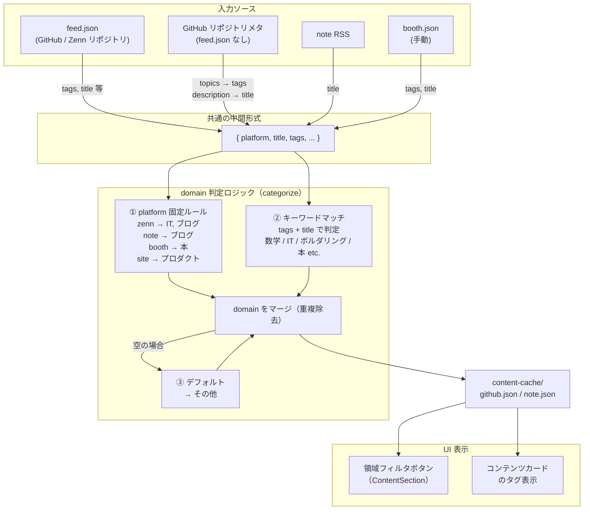

# カテゴリ分類 DFD（Tobe）

## 設計方針

- `type` フィールドを削除（UIに未使用のデッドコード）
- `tags: ["本"]` が `domain` に反映されないバグを修正
  - 原因：`"本"` の検出が `typeRules`（→ `type` フィールド）にのみ存在し、`domainKeywords` にない
  - 修正：`domainKeywords` に `"本"` のパターンを追加し、`typeRules` ごと削除する
- 全入力ソースを共通の中間形式に正規化してから domain 判定する流れに統一する

## データフロー図



## 実装変更スコープ

### `content/category-rules.ts`

- `domainKeywords` に `"本"` パターンを追加
  ```ts
  { pattern: /^本$|^book$/i, domain: "本" },
  ```
- `typeRules` を削除

### `content/categorize.ts`

- `detectType` 関数を削除
- `categorize` から `type` の計算・セットを削除
- `Category.type` フィールドへの参照を削除

### `content/types.ts`

- `ContentType` 型を削除
- `Category.type` フィールドを削除

### `scripts/update-cache.mjs`

- `typeRules`・`type` の計算ロジックを削除
- `category-rules.ts` と同じ `domainKeywords` に `"本"` パターンを追加

### `content-cache/*.json`

- 次回 `update-cache.mjs` 実行時に自動上書き（手動修正不要）
