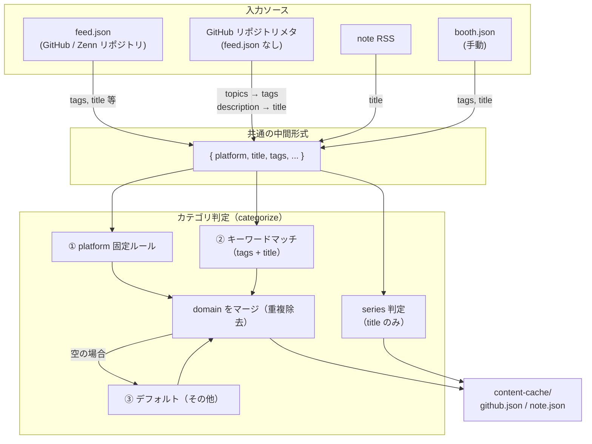

# カテゴリ自動判定仕様

## 概要

各コンテンツには `category.domain`（領域）と `category.series`（シリーズ）が自動付与される。  
判定ロジックは `content/category-rules.ts` に集約されており、`scripts/update-cache.mjs` でも同一ルールを使用している。

## データフロー

## domain 判定ルール

### ① platform 固定ルール

platform に応じて無条件で付与される。

| platform | 付与される domain |
|---|---|
| `zenn` | `IT`、`ブログ` |
| `note` | `ブログ` |
| `booth` | `本` |
| `site` | `プロダクト` |
| `github` | なし（キーワードマッチに委ねる） |

### ② キーワードマッチ

`tags` と `title` を結合したテキストに対してパターンマッチを行う。複数ヒットした場合はすべて付与される。

| domain | マッチするキーワード（代表例） |
|---|---|
| `IT` | typescript, javascript, python, aws, gcp, react, next.js, docker, linux, プログラミング, エンジニア, 開発, api, golang, rust, sql, database, web, フロント, バック, クラウド, terraform, kubernetes |
| `数学` | 数学, math, 線形代数, 微積分, 確率, 統計, 代数, 幾何, 解析, 数式, 行列, ベクトル, 虚数 |
| `ボルダリング` | ボルダリング, クライミング, boulder, climb, 岩, ジム, 課題, グレード |
| `プロダクト` | プロダクト, サービス, リリース, startup, スタートアップ, 個人開発, saas |
| `本` | `本`（単独トークン）, `book`（単独トークン） |

> **注意：** `本` は部分一致ではなくスペース区切りの単独トークンとしてマッチする（例：`基本` にはヒットしない）。

### ③ デフォルト

① ② のいずれにもヒットしなかった場合のフォールバック。

| platform | デフォルト domain |
|---|---|
| `github` | `その他` |
| その他 | `その他` |

## series 判定ルール

`title` に以下のパターンが含まれる場合に `category.series` が付与される。

| series | マッチ条件 |
|---|---|
| `ゼロから` | タイトルに「ゼロから」を含む |

## キーワードの追加・変更

`content/category-rules.ts` の `domainKeywords` / `seriesPatterns` を編集する。  
`scripts/update-cache.mjs` にも同一ルールが複製されているため、**両ファイルを同時に更新すること**。
